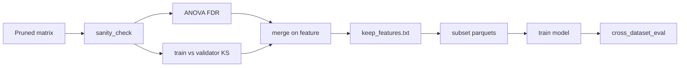

# `feature_1` (miner_1) — feature set workflow

Define or refine a labeled feature matrix, screen it, measure **task** vs **domain** signal, lock columns, train, and eval.

**Principle:** quality (sanity) → task (ANOVA / FDR) → domain (train vs validator KS) → lock list → train → eval.

---

## Pipeline

1. **Freeze representation**  
   Use one pipeline stage everywhere below (e.g. pruned `system_bot` parquets, or robust + E1). Train, ANOVA, and shift must see the **same** columns (validator parquet matches for shift only).

2. **Sanity**  
   `scripts/sanity_check.py` on train+val → `sanity_report.csv`, `sanity_summary.json`.  
   Drop constants / duplicates / redundant twins via `config/drop_after_sanity.txt` + `scripts/subset_parquet_columns.py`, then re-run sanity until clean (e.g. `sanity_summary_pruned.json`).

3. **Task signal (human vs bot)**  
   `workspace/preprocess/statistical_test/anova_bonferroni_FDR_test.py` on the **same** labeled matrix → per-feature F, p, Bonferroni, **FDR**.  
   Volcano / extra plots need **matplotlib** (optional if you only need CSV).

4. **Domain shift (train vs validator)**  
   `workspace/preprocess/statistical_test/train_validator_shift_plots.py` → `train_vs_validator_shift.csv` + plots (KS, FDR, overlays).

5. **Merge and decide**  
   Join ANOVA output ↔ shift CSV on `feature`.  
   **Rule of thumb:** high KS + weak task (FDR not significant / low F) → drop or watch; high KS + strong task → keep and stabilize/harmonize; low KS + strong task → keep.

6. **Lock feature list**  
   `config/keep_features.txt` (or edited drop list). Subset all training / test parquets to `label` + kept columns.

7. **Train**  
   LightGBM (or your trainer) on the locked set.

8. **Evaluate**  
   `workspace/test/cross_dataset_eval.py` on each test parquet; compare to baselines.  
   Use ablation for ambiguous columns.

---

## Flowchart

---

## Commands

Concrete paths and copy-paste commands live in **`command.md`** in this directory.

Scripts under **`scripts/`**; lists under **`config/`**; optional outputs under **`task_signal/`**, **`data/`**, etc., as you create them.
