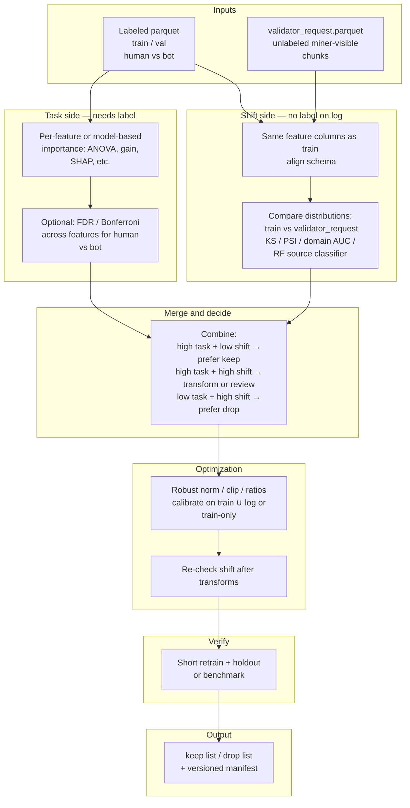

# Statistical tests (`workspace/preprocess/statistical_test`)

Scripts for **feature screening** and **domain / shift** diagnostics on chunk-level parquets. Use them together with labeled training data and, when available, **validator-shaped** tables (e.g. `workspace/ssl_data/raw_data/validator_request.parquet` from `build_raw_dataset_for_domain.py`).

## Scripts in this folder

| File | Role |
|------|------|
| `anova_bonferroni_FDR_test.py` | One-way ANOVA **human vs bot** per feature; Bonferroni + Benjamini–Hochberg FDR; optional merge with `domain_shift_probe` CSV; optional plots under `statistical_test/plots/`. |
| `domain_shift_probe.py` | Train a classifier to predict **data source** from features; ranks features that separate domains (fingerprint risk). |
| `train_validator_shift_plots.py` | **Train vs `validator_request`:** per-feature **KS** test, BH-FDR, CSV + **default PNG plots** (see below). |
| `run_statistical_pipeline.py` | **Orchestrator:** shift → ANOVA → merged CSV (`shift_*` columns) → `select_features` (optional JSONL→parquet build). |
| `select_features.py` | From ANOVA CSV: auto **keep** / **watch** / **drop** lists (weak vs strong separation). |

## Plots and tabular outputs

Plots are **diagnostic**, not ground truth: combine with labeled-task stats before hard-dropping features.

| Tool | Tabular output | Plots (default or flag) |
|------|----------------|-------------------------|
| `anova_bonferroni_FDR_test.py` | Combined CSV (`--out-csv`) | **On by default** → `workspace/preprocess/statistical_test/plots/` (volcano, domain vs task if merged, keep_score, …). Use `--no-plots` to skip. |
| `domain_shift_probe.py` | `feature_shift_report.csv`, `report.md`, `summary.json` | Add `--plot-top-k N` (e.g. `15`) for per-feature bar/box plots under `<out-dir>/plots/`. |
| `train_validator_shift_plots.py` | `train_vs_validator_shift.csv`, `summary.json` | **On by default** → `plots/train_vs_validator/`: `shift_ks_top_barh.png`, `shift_neglog10p_top_barh.png`, `shift_mean_train_vs_validator.png`, `shift_distribution_overlays.png`. Use `--no-plots` to skip. |

**`train_validator_shift_plots.py` — example (repo root)**

```bash
python3 workspace/preprocess/statistical_test/train_validator_shift_plots.py \
  --train-parquet workspace/dataset/unpreprocessed/train/train.parquet \
  --validator-parquet workspace/ssl_data/raw_data/validator_request.parquet \
  --out-dir workspace/preprocess/statistical_test/plots/train_vs_validator
```

Optional: `--stratify-train-label` when subsampling train so human/bot mix is preserved; `--max-rows-per-source 0` for full tables (heavier).

## Two data types, two questions

| Data | Question you can answer |
|------|-------------------------|
| **Labeled train/val** (human vs bot) | Is this feature **useful for the task**? |
| **Unlabeled validator log parquet** (e.g. `validator_request.parquet`) | Does this feature **match live traffic** vs train (**shift**, fingerprint)? |

**Without labels** on the log you **cannot** run ANOVA-style **human vs bot** tests on that file alone. You **can** still compare **train vs validator_request** (two **sources**) for shift-focused statistics.

Neither table alone defines the final feature list: labels alone can miss **serve-time drift**; shift alone does not measure **bot vs human** usefulness.

## Overall pipeline (task + shift + merge + verify)



### Same pipeline (ASCII — works without Mermaid)

```
  INPUTS
  ┌─────────────────────────┐     ┌──────────────────────────────┐
  │ Labeled train/val       │     │ validator_request.parquet    │
  │ (human vs bot)          │     │ (unlabeled, miner-visible)   │
  └───────────┬─────────────┘     └──────────────┬───────────────┘
              │                                   │
              v                                   v
  TASK SIDE (needs label)              SHIFT SIDE (source = train vs log)
  ┌─────────────────────────┐     ┌──────────────────────────────┐
  │ ANOVA / gain / SHAP …     │     │ Align columns with train     │
  │ optional FDR / Bonferroni │     │ KS / PSI / domain AUC / RF … │
  └───────────┬─────────────┘     └──────────────┬───────────────┘
              │                                   │
              └──────────────┬────────────────────┘
                             v
                    ┌─────────────────┐
                    │ Merge & decide  │
                    │ task vs shift   │
                    └────────┬────────┘
                             v
                    ┌─────────────────┐
                    │ Optimization    │
                    │ norm / clip …   │
                    │ re-check shift  │
                    └────────┬────────┘
                             v
                    ┌─────────────────┐
                    │ Verify          │
                    │ retrain / bench │
                    └────────┬────────┘
                             v
                    ┌─────────────────┐
                    │ Output          │
                    │ keep/drop +     │
                    │ manifest        │
                    └─────────────────┘
```

**Summary:** labeled data answers *good for human vs bot*; validator parquet answers *stable under real traffic*; merge with judgment, re-scale and re-check shift where needed, then confirm with a short retrain.

The **Optimization / re-check shift** box in the diagram is **not** a separate script: after you change norm/clip/transforms, **re-run** `train_validator_shift_plots.py` (or the orchestrator with `--skip-anova --skip-select-features`) on parquets built with the **new** pipeline.

## Overall commands (end-to-end)

Run from **repository root** (`Poker44-subnet`). Adjust paths if your labeled data or `validator_request.parquet` lives elsewhere.

### Automated orchestration (`run_statistical_pipeline.py`)

Single entrypoint that runs, in order:

1. **(Optional)** `build_raw_dataset_for_domain.py` if `--build-validator-parquet`  
2. `train_validator_shift_plots.py`  
3. `anova_bonferroni_FDR_test.py` (default `--disable-domain-shift-merge`; use `--anova-domain-shift-csv` for probe merge)  
4. **Merge** ANOVA + shift CSV on `feature` → `artifacts/merged_anova_and_train_vs_validator_shift.csv` (shift columns prefixed with `shift_`)  
5. `select_features.py` → `artifacts/feature_selection/`

```bash
cd /path/to/Poker44-subnet

# Default paths; requires train+val under train and validator_request.parquet
python3 workspace/preprocess/statistical_test/run_statistical_pipeline.py

# Rebuild validator parquet from JSONL, then full pipeline
python3 workspace/preprocess/statistical_test/run_statistical_pipeline.py --build-validator-parquet

# ANOVA from explicit parquets (e.g. train + val files, no --anova-data-dir)
python3 workspace/preprocess/statistical_test/run_statistical_pipeline.py \
  --anova-parquet workspace/dataset/unpreprocessed/train/train.parquet \
  --anova-parquet workspace/dataset/unpreprocessed/train/val.parquet
```

Useful flags: `--skip-shift`, `--skip-anova`, `--skip-select-features`, `--skip-merge`, `--max-rows-per-source N`, `--stratify-train-label`, `--shift-no-plots`, `--anova-no-plots`, `--repo-root`.

**Prerequisites**

- **ANOVA step:** `--data-dir DIR` requires **both** `DIR/train.parquet` **and** `DIR/val.parquet` with a **`label`** column (`0` = human, `1` = bot). If you only have one labeled file, use **`--parquet path/to/file.parquet`** (repeatable) instead of `--data-dir`.
- **Sample schema:** `build_raw_dataset_for_domain.py --sample` must match raw `aggregate_chunk_from_hands` columns (same as miner chunk rows).
- **Python deps:** `pyarrow`, `pandas`, `numpy`, `scipy`, `scikit-learn` (ANOVA / `select_features`), `matplotlib` for plots.

### 0. (Optional) Build `validator_request.parquet` from miner JSONL

Skip if `workspace/ssl_data/raw_data/validator_request.parquet` already exists.

```bash
python3 workspace/ssl_data/build_raw_dataset_for_domain.py \
  --input-source-dir workspace/ssl_data/json \
  --sample workspace/dataset/unpreprocessed/train/train.parquet \
  --outdir workspace/ssl_data/raw_data \
  --output-name validator_request.parquet
```

### 1. Shift: train vs validator (KS + plots + CSV)

```bash
python3 workspace/preprocess/statistical_test/train_validator_shift_plots.py \
  --train-parquet workspace/dataset/unpreprocessed/train/train.parquet \
  --validator-parquet workspace/ssl_data/raw_data/validator_request.parquet \
  --out-dir workspace/preprocess/statistical_test/plots/train_vs_validator \
  --max-rows-per-source 0
```

Use a positive `--max-rows-per-source` (e.g. `50000`) if full tables are too heavy. Optional: `--stratify-train-label` to preserve human/bot mix when subsampling train.

**Writes (under repo root):**  
`workspace/preprocess/statistical_test/plots/train_vs_validator/train_vs_validator_shift.csv`,  
`workspace/preprocess/statistical_test/plots/train_vs_validator/summary.json`,  
and the four `shift_*.png` files in that same directory.

### 2. Task: ANOVA + Bonferroni + FDR (+ plots)

```bash
python3 workspace/preprocess/statistical_test/anova_bonferroni_FDR_test.py \
  --data-dir workspace/dataset/unpreprocessed/train \
  --disable-domain-shift-merge \
  --out-csv workspace/preprocess/statistical_test/artifacts/anova_bonferroni_FDR_combined.csv \
  --plots-dir workspace/preprocess/statistical_test/plots
```

The script creates the parent directory for `--out-csv` automatically (`artifacts/` does not need to exist beforehand).

**Alternative — single labeled parquet (no `val.parquet` in that folder):**

```bash
python3 workspace/preprocess/statistical_test/anova_bonferroni_FDR_test.py \
  --parquet path/to/labeled_chunks.parquet \
  --disable-domain-shift-merge \
  --out-csv workspace/preprocess/statistical_test/artifacts/anova_bonferroni_FDR_combined.csv \
  --plots-dir workspace/preprocess/statistical_test/plots
```

**Optional — multivariate domain merge for ANOVA plots / `keep_score`:** run `domain_shift_probe.py` with e.g. `--source train=... --source validator=...`, then rerun ANOVA **without** `--disable-domain-shift-merge` and set `--domain-shift-csv` to that probe’s `feature_shift_report.csv`.  
**Note:** `train_vs_validator_shift.csv` (KS) does **not** match `--domain-shift-csv` (domain classifier probe). For KS + ANOVA in one table, use **`run_statistical_pipeline.py`** (writes `merged_anova_and_train_vs_validator_shift.csv`) or join on `feature` yourself.

**Writes:**  
`workspace/preprocess/statistical_test/artifacts/anova_bonferroni_FDR_combined.csv`  
and PNGs under `workspace/preprocess/statistical_test/plots/` (volcano, etc.; domain-vs-task panels only if a probe CSV was merged).

### 3. Final feature lists: keep / watch / drop

```bash
python3 workspace/preprocess/statistical_test/select_features.py \
  --anova-csv workspace/preprocess/statistical_test/artifacts/anova_bonferroni_FDR_combined.csv \
  --out-dir workspace/preprocess/statistical_test/artifacts/feature_selection
```

### Final outputs (features and artifacts)

Paths below are relative to **repository root**.

| Path | Role |
|------|------|
| `workspace/preprocess/statistical_test/artifacts/feature_selection/keep_features.txt` | Primary **keep** list for training / downstream preprocess. |
| `workspace/preprocess/statistical_test/artifacts/feature_selection/watch_features.txt` | Borderline — review / ablation. |
| `workspace/preprocess/statistical_test/artifacts/feature_selection/drop_features.txt` | Suggested **drop** from ANOVA rules. |
| `workspace/preprocess/statistical_test/artifacts/feature_selection/selection_summary.csv` | Per-feature **decision**, **reason**, and key stats. |
| `workspace/preprocess/statistical_test/artifacts/anova_bonferroni_FDR_combined.csv` | Full task-side table. |
| `workspace/preprocess/statistical_test/artifacts/merged_anova_and_train_vs_validator_shift.csv` | **Outer join** ANOVA + shift on `feature` (shift columns `shift_*`; from `run_statistical_pipeline.py`). |
| `workspace/preprocess/statistical_test/plots/train_vs_validator/train_vs_validator_shift.csv` | Per-feature KS, p-value, BH-FDR, means. |

### One chained command (after `validator_request.parquet` exists)

Requires **`workspace/dataset/unpreprocessed/train/train.parquet`** and **`val.parquet`** (or change `--data-dir` / use `--parquet`).

```bash
cd /path/to/Poker44-subnet

python3 workspace/preprocess/statistical_test/train_validator_shift_plots.py \
  --train-parquet workspace/dataset/unpreprocessed/train/train.parquet \
  --validator-parquet workspace/ssl_data/raw_data/validator_request.parquet \
  --out-dir workspace/preprocess/statistical_test/plots/train_vs_validator \
  --max-rows-per-source 0 && \
python3 workspace/preprocess/statistical_test/anova_bonferroni_FDR_test.py \
  --data-dir workspace/dataset/unpreprocessed/train \
  --disable-domain-shift-merge \
  --out-csv workspace/preprocess/statistical_test/artifacts/anova_bonferroni_FDR_combined.csv \
  --plots-dir workspace/preprocess/statistical_test/plots && \
python3 workspace/preprocess/statistical_test/select_features.py \
  --anova-csv workspace/preprocess/statistical_test/artifacts/anova_bonferroni_FDR_combined.csv \
  --out-dir workspace/preprocess/statistical_test/artifacts/feature_selection
```

`anova_bonferroni_FDR_test.py` creates `workspace/preprocess/statistical_test/artifacts/` when writing the CSV; no separate `mkdir` is required.

## Reference: terms and statistics

### KS statistic (Kolmogorov–Smirnov)

Compares **two samples** of the same feature (e.g. **train** vs **validator**). The **KS statistic** is in **[0, 1]** and measures **how different the two empirical distributions** are.

- **Near 0** → distributions look **similar** (weak marginal shift).  
- **Near 1** → distributions look **very different** (strong **shift** for that feature).

This is **not** human vs bot; it only answers whether the feature’s **marginal distribution** changes between **sources** (train parquet vs validator log parquet).

### BH-FDR (Benjamini–Hochberg false discovery rate)

When you test **many features**, some raw p-values will look “significant” by chance. **BH-FDR** adjusts p-values into **q-values** (`p_fdr_bh` in CSVs) so that, among features you flag, you control the **expected fraction of false discoveries** (FDR). It is typically **less strict** than Bonferroni but still corrects for **multiple testing**.

- **`p_fdr_bh < 0.05`** (often “q < 0.05”) → flagged under an FDR 5% rule (see plot legends).

### Bonferroni correction

Another **multiple-testing** adjustment: use a **stricter** per-test threshold, roughly **α / (number of tests)** (e.g. 0.05 / 79 features), so the chance of **at least one false positive across all tests** stays controlled (**family-wise error**).

- **Pros:** simple, conservative.  
- **Cons:** often **low power** (misses real effects).  

`anova_bonferroni_FDR_test.py` reports **both** Bonferroni and BH-FDR so you can compare strict vs FDR-style cutoffs.

### Top‑k KS features

**Top‑k** means the **k** features ranked highest by some criterion. **Top‑k KS features** are the **k features with the largest KS statistic** (train vs validator): the **most shifted** marginals first.

Plots such as `shift_ks_top_barh.png` show these for quick review. **High KS** suggests **domain / scaling / regime** mismatch—not by itself a reason to drop a feature without also checking **task signal** (human vs bot) on labeled data.

## Related paths

- Validator-shaped raw parquet builder: `workspace/ssl_data/build_raw_dataset_for_domain.py`
- SSL / robust train build: `workspace/ssl_data/build_dataset.py`
- High-level strategy notes: `workspace/docs/LONGTERM_STRATEGY.md`
